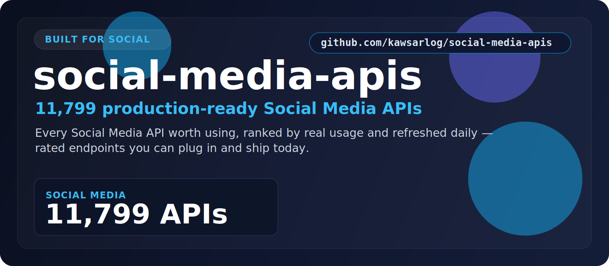

  

  <a href="#at-a-glance"><b>At a Glance</b></a> &nbsp;•&nbsp;
  <a href="#the-categories"><b>Categories</b></a> &nbsp;•&nbsp;
  <a href="#start-here"><b>Start Here</b></a> &nbsp;•&nbsp;
  <a href="#built-for"><b>Built For</b></a> &nbsp;•&nbsp;
  <a href="#why-this-repo"><b>Why This Repo</b></a>

## At a Glance

> **11,799** production-ready Social Media APIs.

A focused, always-fresh index of Social Media APIs for posts, profiles, and engagement across networks. Every entry is rated, shows real user counts, and is refreshed daily — so you find the right one fast.

| Metric | Value |
|--------|-------|
| **Total APIs** | **11,799** |
| **Categories** | 1 |
| **Last updated** | 2026-07-16 |
| **Update cadence** | Daily, automated |

## The Categories

<table>
  <tr>
    <td width="100%" valign="top">
      <h3>Social Media</h3>
      
<strong>11,799 APIs</strong>

      
Posts, profiles, and engagement data across major social networks.

      
<a href="./Social_media/"><strong>Open Social Media &rarr;</strong></a>

    </td>
  </tr>
</table>

## Start Here

1. Pick the category that matches what you're building.
2. Open its folder and scan the API names, ratings, and user counts.
3. Click through to the provider page for docs, pricing, and setup.
4. Shortlist in minutes — no digging through unrelated categories.

## Explore the Stack

<strong>Social Media — 11,799 APIs</strong>

Posts, profiles, and engagement data across major social networks.

[Browse Social Media APIs &rarr;](./Social_media/)

## Built For

<table>
  <tr>
    <td width="25%" align="center"><strong>Social tools</strong></td>
    <td width="25%" align="center"><strong>Influencer intel</strong></td>
    <td width="25%" align="center"><strong>Sentiment</strong></td>
    <td width="25%" align="center"><strong>Trend tracking</strong></td>
  </tr>
  <tr>
    <td width="25%" align="center"><strong>Content apps</strong></td>
    <td width="25%" align="center"><strong>Analytics</strong></td>
    <td width="25%" align="center"><strong>Agencies</strong></td>
    <td width="25%" align="center"><strong>Marketers</strong></td>
  </tr>
</table>

## Why This Repo

- **Opinionated, not exhaustive.** Only the categories that matter here — no clutter.
- **Always fresh.** A scheduled job re-scrapes the source and updates the counts daily.
- **Fast to scan.** Ratings and real usage numbers surface the APIs worth your time.
- **Consistent.** Every category follows the same clean, sortable layout.

## Star History

---

**11,799 APIs** across **1 categories** — updated 2026-07-16
 If this saved you time, a star helps others find it.

